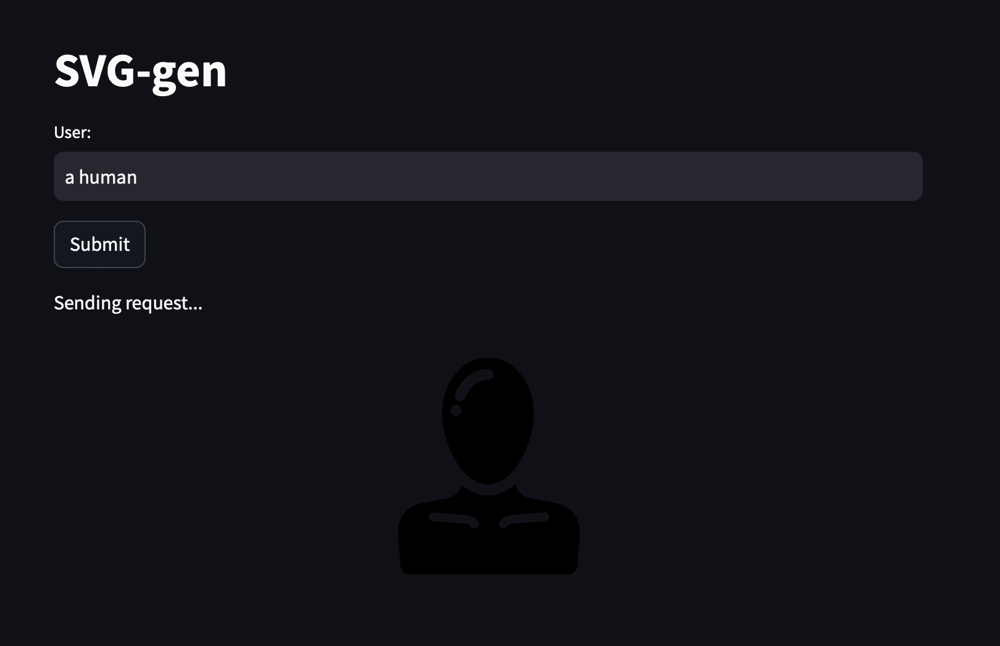
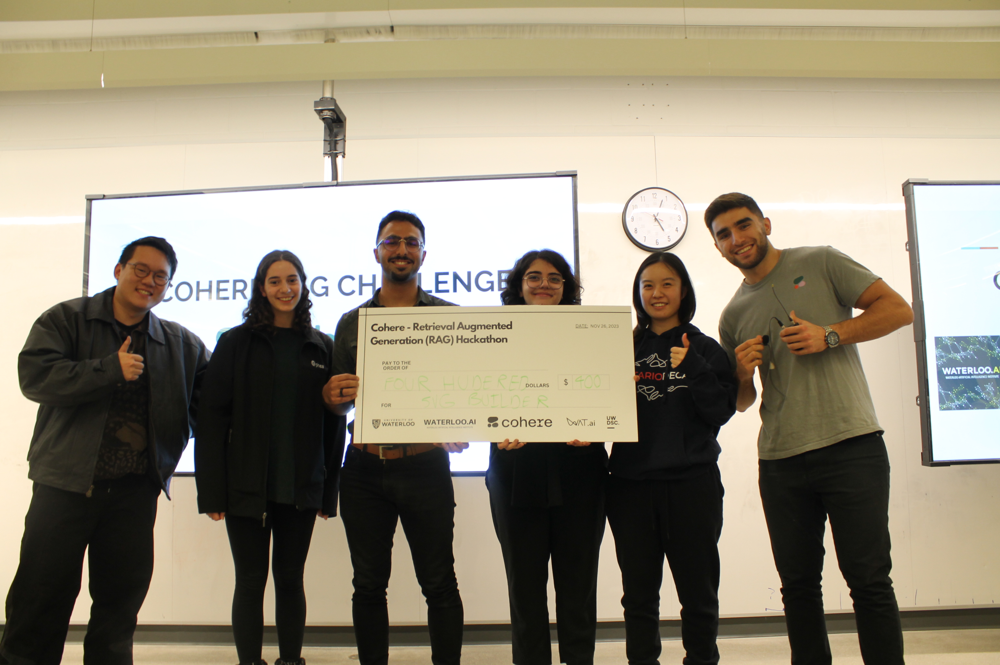

# svg-gen | Generate SVGs with LLMs.

# [Devpost](https://devpost.com/software/svg-gen) / Demo

# Winners at the Cohere RAG Hackathon

_Pictured Left to right: Ivan Zhang (Cohere CTO), Olivia Markham (UW TRON '27), Ali Shariatmadari (UW SE '25), Paniz Ojaghi (UW SE '26) Jillian Xu (UWCS '27), Faraz Khoubsirat(UW SE '25, Cohere MLE)_

# Inspiration:

Are you a designer? Do you mess around in figma and spend hours finding the perfect SVGs icons to use? Do you find messing around in tools like Adobe Illustrator and Affinity Designer hard?
Why not use AI to generate your svgs for you?
We noticed that existing models (even GPT-4-turbo) are [surprisingly bad at generating even basic svgs](https://praeclarum.org/2023/04/03/chatsvg.html). We set out to make it easier for you to generate and customize SVGs.

# What it Does

Given a simple user prompt, you can ask for an SVG of an item and even customize attributes such as the color. Example: `bed with a green frame`.

# How we did it

We decided to use Retrieval-Augmented Generation (RAG) with Cohere's embedding and chat APIs, alongside a massive embedding of 300,000 SVG files to let you retrieve, customize, and mix svgs! It is also possible to know exactly which icon library the original svg file came from to give proper attributions and purchase the correct licenses.

We used streamlit and hnswlib for a local front-end and vector store of our embeddings.

# Limitations

The code is in an extremely preliminary state and is provided as-is. Do not expect top-tier functionality, but rather more of a tech demo. Feel free to expand and refine it as you wish :)

To load your own svg library, check out the `directory.py` file.

Due to the context size limitations of the cohere apis, we are limited as to how many svgs we can mix and match (and with what level of detail). We believe running this same technique with a larger context window can dramatically improve the performance.
